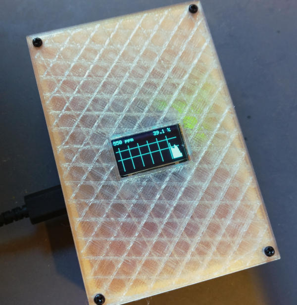
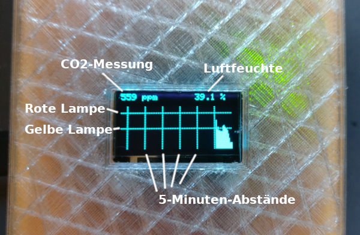
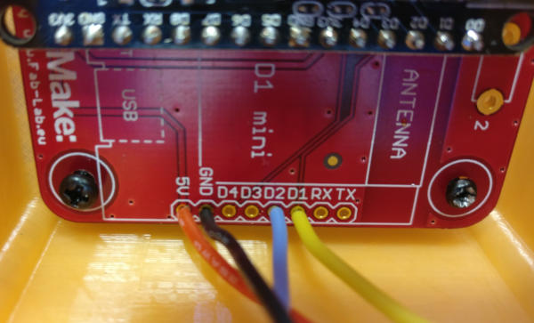
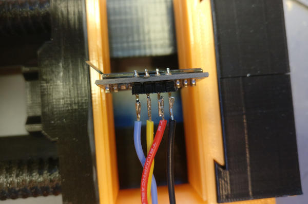
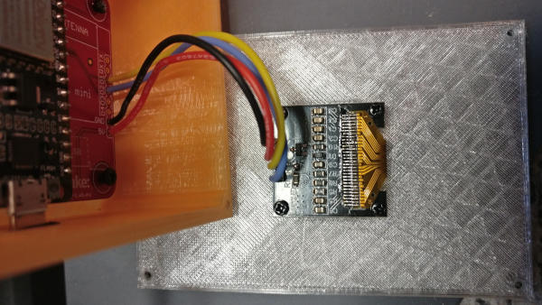

# CO2-Ampel mit OLED-Display

## Benutzung

### Selbsttest

Nach dem Einschalten führt die Software einen rudimentären Selbsttest aus. Man kann ich auch auf der seriellen Konsole beobachten. Zunächst werden alle LEDs für eine Sekunde eingeschaltet. Wenn keine Fehler auftraten, beginnt die grüne LED zu blinken, bis der erste Messwert vom CO2-Sensor vorliegt.

Andere Blinkcodes haben folgende Bedeutung:

* Rot blinkt: Fehler beim Initialisieren des I2C-Busses (Problem mit Pull-Up-Widerständen?)
* Rotes Licht, gelb blinkt: Der CO2-Sensor reagiert auf dem I2C-Bus nicht (Problem mit Lötstellen? Sensor defekt?)
* Gelb blinkt: Der CO2-Sensor konnte nicht initialisiert werden

### Anzeige

Nach dem Selbsttest geht das Program in den „Ampelmodus“ und aktualisiert alle 15 Sekunden Display und Ampelstatus.
Auf dem Display sieht man die aktuell gemessene CO2-Konzentration sowie die relative Luftfeuchte. Die Balkengrafik zeigt die Historie der Messwerte an. Die senkrechten unterbrochenen Linien sind im Abstand von 5 Minuten dargestellt. Die waagrechten unterbrochenen Linien sind die Schwellwerte für gelbes und rotes Warnlicht.

## Selber bauen

### Bauteile

* [Octopus-SCD30-Bundle](https://www.tindie.com/products/FabLab/diy-octopus-scd30-bundle-kit/) von Guido Burger
* 0,96" Monochrom-OLED I2C Display-Modul - z.B. von [Amazon](https://www.amazon.de/-/en/AZDelivery-OLED-Parent-Pixel-Inches/dp/B01L9GC470/) oder [AliExpress](https://www.aliexpress.com/item/32638662748.html)
* 12 M2-Schräubchen (3 - 5 mm lang) zum Befestigen der Teile und des Deckels.
* Lötequipment, etwas Kabel zum Anschluss des Displays

### 3d-Gehäuse drucken

Im Verzeichnis 3dprint befinden sie die STL-Dateien für Deckel und Gehäuse,
sowie der Quelltext zur Bearbeitung in [OpenSCAD](https://www.openscad.org/). Beim Druck sollte eine Layer Height von 0,3 genügen (geht schneller ;-).
Für den Deckel sollte ein möglichst durchscheinendes Filament verwendet werden, damit man die Ampel-LEDs gut sieht.

### Zusammenbau

Octopus-Platine nach Anleitung zusammenlöten: Mit den flachen Bauteilen beginnen, etc. Wer will, kann die LED-Beinchen möglichst lange lassen, so dass sie möglichst dicht an den Gehäusedeckel ragen (deshalb das Gehäuse vorher drucken, um die Länge abschätzen zu können) - der man modifiziert das Gehäuse und platziert die LEDs in Aussparungen.

Kabel zum Display befestigen: Diese werden an GND, 5V, D1 und D2 angelötet:

Diese werden am Display-Modul angelötet: 5V führt an VCC, D1 an SCL, D2 an SDA (Beschriftung am Display-Modul beachten! Die sind je nach Hersteller nicht immer in der dargestellten Reihenfolge!)

Nun kann das Display (und, wenn noch nicht geschehen, die Platine) vorsichtig am Gehäuse befestigt werden (beim Display aufpassen, dass man das Glas nicht irgendwo verkantet - es bricht sehr leicht)

Nun den Deckel auf der Box mit Schrauben befestigen.

### Aufspielen der Firmware

Da die Platine keinen Luftdrucksensor besitzt, sollte vor dem Übersetzen die Konstante `ALTITUDE` auf die (ungefähre) Höhe über NN des Einsatzortes gesetzt werden.
Die Software lässt sich mit dem [PlatformIO-Plugin](https://platformio.org/) in VSCode übersetzen und auf den ESP spielen.  Standardmäßig sind die Schwellwerte für gelb auf 1000 ppm und rot auf 1500 ppm konfiguriert. Dies lässt sich mit den entsprechenden Konstanten anpassen.

## Lizenz

Dieses Projekt (Software, 3D-Modell) steht unter der [Creative-Comons-Lizenz Namensnennung-Nicht kommerziell-Share Alike 4.0 International](https://creativecommons.org/licenses/by-nc-sa/4.0/deed.de).

